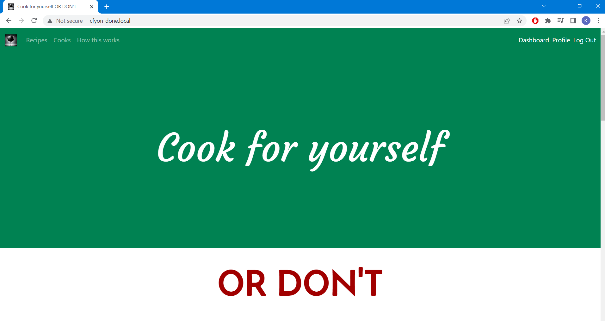
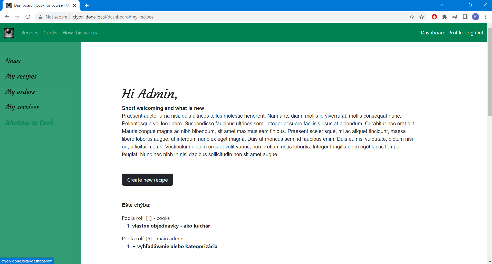
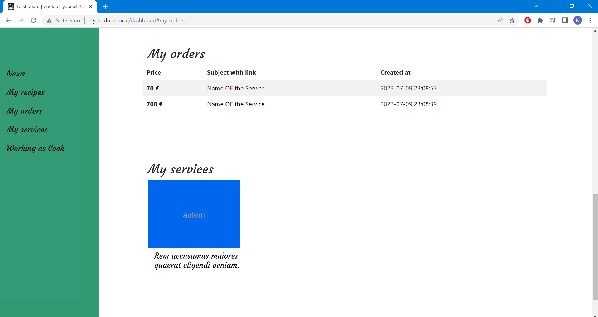
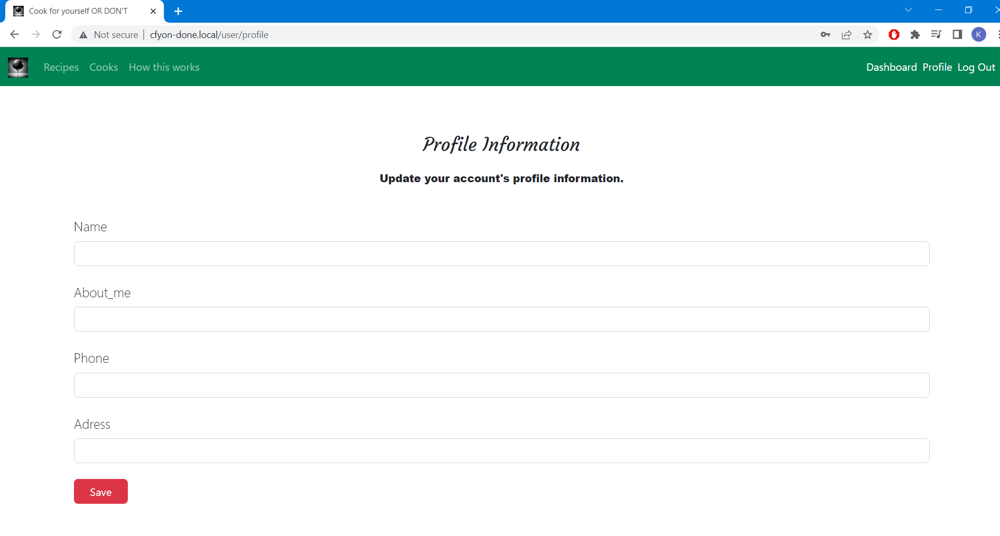
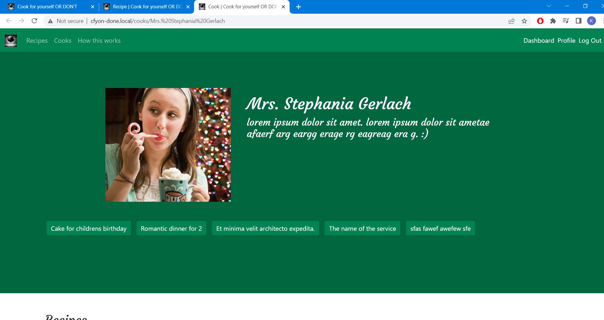
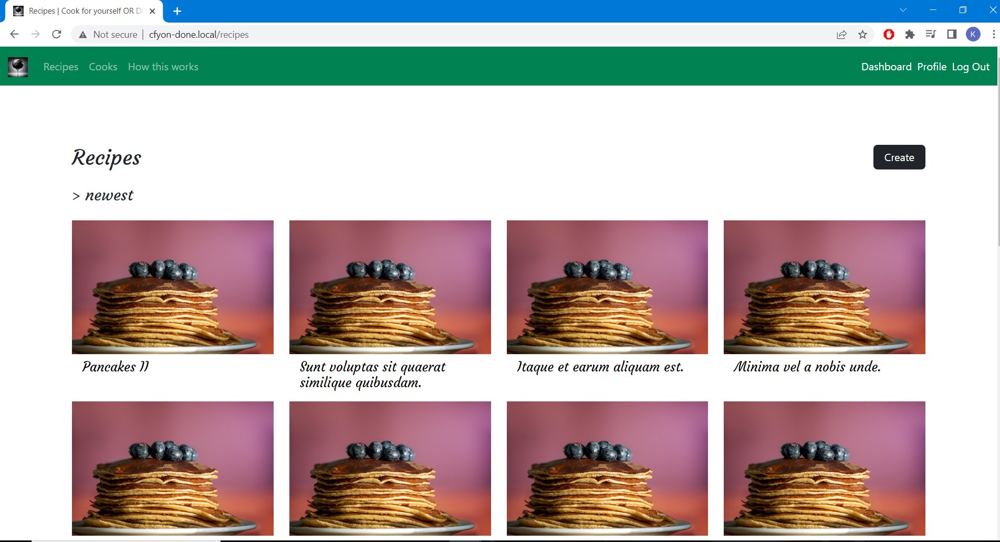
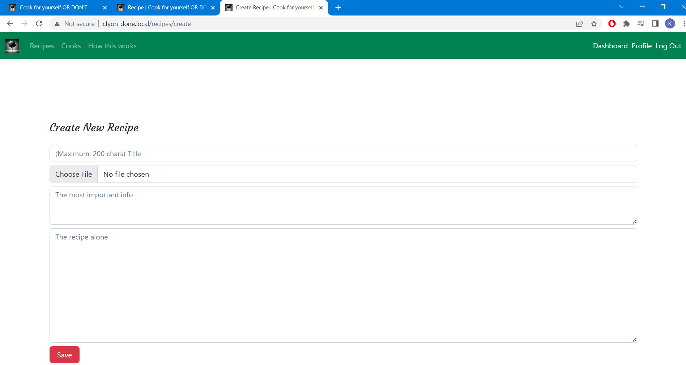
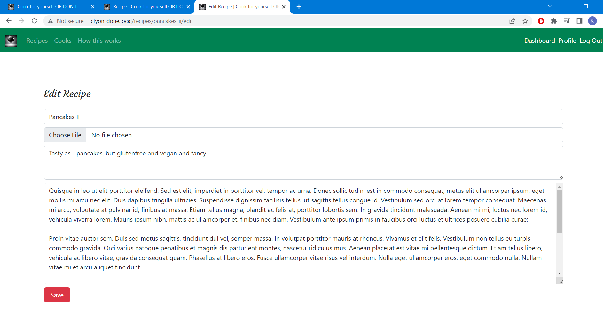
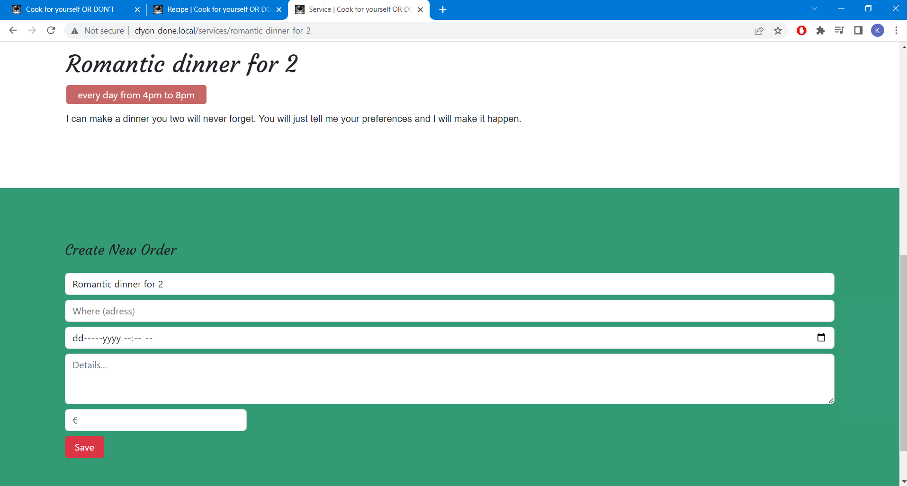

#Setup your project
1) Download or clone this repository
2) setup local domain and db
3) db:seed (factories are written)
4) npm install

#Images of website

1) Frontpage

2) Dashboard

3) One cook

4) Recipes

5) Create order

